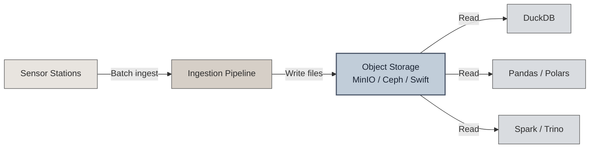
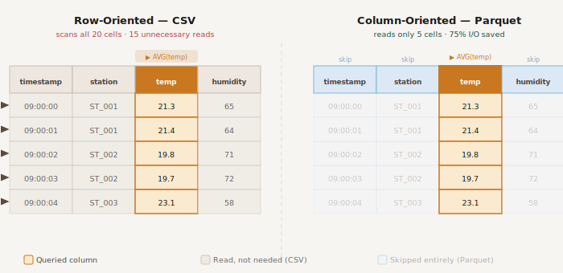
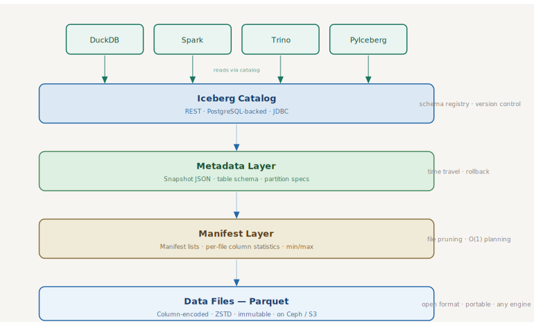
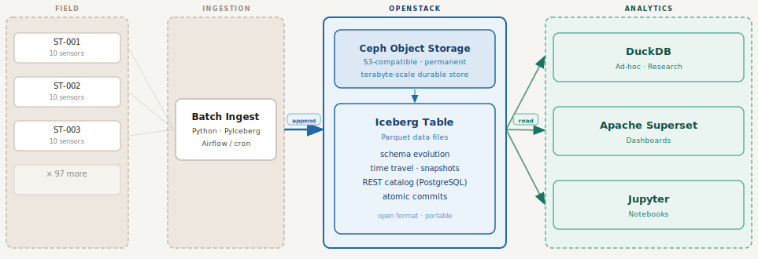

# Numairsia - Time-Series Data Store Evaluation

Storage Architecture for Environmental Sensor Data

> *Solutions evaluation prepared for the Numairsia project as of March 2026*
---

## 1. Objectives and Specifications

### 1.1 Project Objectives

The Numairsia project collects environmental measurements like temperature, humidity, and other weather-related variables from a network of roughly 100 field stations. Each station hosts about 10 sensors, each sampling a different physical quantity at intervals ranging from once per second to once per minute.

The goal is straightforward: design a data store that can reliably ingest, retain permanently, and make queryable the full history of this sensor data. The design should be simple to operate, built on open standards, and resistant to vendor lock-in. It must run on a private Compute Canada OpenStack cloud and remain easy to migrate if the infrastructure changes in the future.

### 1.2 High-Level Specifications

Before evaluating solutions, it helps to lay out the constraints that matter most and to rank them. Not every requirement carries equal weight for an architecture decision.

| Specification | Detail | Priority |
| --- | --- | --- |
| **Data volume** | ~100 stations × ~10 sensors × 1s to 1min sampling | Medium |
| **Ingestion pattern** | Batch ingestion, append-only | High |
| **Ingestion rate** | ~1 to 10 events/sec/station (~100 to 1,000 events/sec total) | Low-Medium |
| **Retention** | Permanent. No data is ever discarded | **Critical** |
| **Expected scale** | Terabyte range | Medium |
| **Open standards & formats** | Prefer open source, open formats | **Critical** |
| **Vendor lock-in avoidance** | Must be portable across infrastructure | **Critical** |
| **Low-regret design** | Favor reversible, future-proof choices | **Critical** |
| **Infrastructure** | Private OpenStack cloud | High |
| **Migration ease** | Data store must be easy to move | High |

A few observations jump out immediately:

- **The ingestion rate is modest.** A few hundred events per second is well within reach of almost any database. This is not a high-frequency trading floor or a large-scale IoT platform with millions of devices. The data volume grows steadily but is not explosive.
- **Permanent retention is non-negotiable.** This rules out architectures that rely on TTL-based expiration or that become expensive to maintain as data ages.
- **Portability and openness dominate.** The choice of data format and storage layer matters more than raw query speed. A design that traps data inside a proprietary engine is a poor fit, regardless of performance.
- **Batch ingestion simplifies the problem.** There is no requirement for sub-second write latency or real-time streaming ingestion. Data arrives in batches, which opens the door to simpler, file-based storage strategies.

These priorities naturally lead to two categories of solutions worth evaluating:

1. **Hot storage** : transactional time-series databases designed for real-time ingestion and low-latency queries.
2. **Cold storage** : file-based architectures on object storage, where the query engine is decoupled from the storage layer.

The following sections examine both.

---

## 2. Possible Solutions

### 2.1 Hot Storage Solutions

Hot storage solutions are purpose-built databases optimized for ingesting and querying time-series data with low latency. They handle indexing, compression, and query planning internally. For many real-time monitoring use cases, they are the obvious choice.

Three mature options are worth examining for this project.

---

#### TimescaleDB

TimescaleDB is a PostgreSQL extension that adds time-series capabilities to the world's most popular relational database. It organizes data into *hypertables* (logical tables automatically partitioned into time-based chunks). It supports full SQL, continuous aggregates, and columnar compression that can achieve 90%+ storage reduction.

**Where it works well:** Teams that already use PostgreSQL and need time-series features without adopting a new database. IoT, DevOps monitoring, financial analytics, and SaaS metrics are common use cases.

| Aspect | Assessment |
| --- | --- |
| **Query language** | Full SQL (PostgreSQL-native) |
| **Open source** | Apache 2 Edition available; Community Edition includes additional features under the Tiger Data License |
| **Compression** | Columnar compression, up to 95% |
| **Schema flexibility** | Standard SQL DDL, ALTER TABLE supported |
| **Ecosystem** | Huge ... any PostgreSQL tool works |
| **Self-hosting** | Straightforward on Linux, Docker, Kubernetes |

**Pros for Numairsia:**

- Familiar SQL interface with no learning curve.
- Strong ecosystem; Python, and virtually any BI tool integrate natively.
- Compression and retention policies help manage long-term storage.
- Data correction is easy: unlike many TSDBs, you can UPDATE rows.

**Cons for Numairsia:**

- Data lives inside PostgreSQL. Migrating away means exporting everything.
- Long-term retention at TB scale requires careful tuning of chunk sizes, compression policies, and potentially tiered storage.
- Some advanced features are not in the Apache 2 Edition and require the Community Edition under the Tiger Data License.
- The database *is* the storage. There is no clean separation between the query engine and the data files.

---

#### InfluxDB 3

InfluxDB 3 is a complete rewrite of InfluxDB, built in Rust on top of Apache Arrow, DataFusion, and Parquet. The open-source version (InfluxDB 3 Core) reached general availability in April 2025, licensed under MIT/Apache 2.0. It uses a "diskless" architecture where all persistent data is stored as Parquet files in object storage.

**Where it works well:** Real-time monitoring, metrics collection, and event analytics where high ingestion throughput and recent-data queries are the priority.

| Aspect | Assessment |
| --- | --- |
| **Query language** | SQL and InfluxQL |
| **Open source** | Core under MIT/Apache 2.0 |
| **Storage format** | Apache Parquet on object storage |
| **Architecture** | Single-node; Enterprise adds HA and compaction |
| **Ecosystem** | Telegraf, Grafana, Arrow Flight for interop |

**Pros for Numairsia:**

- Built on open standards (Arrow, Parquet, DataFusion).
- Data ends up in Parquet files, which are readable by many tools.
- The "diskless" design aligns well with object storage on OpenStack.
- Permissive open-source license.

**Cons for Numairsia:**

- The open-source Core version lacks a compactor. Over time, uncompacted Parquet files accumulate and degrade query performance on historical data.
- Enterprise features (compaction, HA, read replicas) require a commercial license.
- InfluxDB has a history of major architectural changes across versions (1.x → 2.x → 3.x). There is migration guidance and compatibility support, but not a seamless in-place upgrade path across those generations. This is still a meaningful low-regret concern.
- The community edition is explicitly positioned for recent-data workloads, not long-range historical queries.
- The project is still maturing and the GA (general availability) release is less than a year old.

---

#### QuestDB

QuestDB is a high-performance time-series database written in Java and C++, designed for extremely fast ingestion and low-latency analytical queries. It uses a columnar storage engine with SIMD-optimized vectorized execution. Recent versions support a three-tier storage model: WAL → native columnar → Parquet on object storage, but automated tiering to object storage is tied to Enterprise capabilities.

**Where it works well:** Capital markets, high-frequency sensor data, and any use case where ingestion speed and query latency are paramount. It excels at millions of rows per second.

| Aspect | Assessment |
| --- | --- |
| **Query language** | SQL with time-series extensions (SAMPLE BY, ASOF JOIN) |
| **Open source** | Core under Apache 2.0; Enterprise is commercial |
| **Storage format** | Native columnar + Parquet tiering |
| **Architecture** | Single-node; Enterprise adds HA and replication |
| **Ecosystem** | Grafana, InfluxDB Line Protocol, PostgreSQL wire protocol |

**Pros for Numairsia:**

- Extremely fast for time-series queries and ingestion.
- Historical data can live in open formats, but the most attractive automated cold-tiering workflow is not fully available in the open-source core.
- Apache 2.0 licensed core.
- SQL-based, with useful time-series extensions.
- Parquet + Iceberg support is being actively developed.

**Cons for Numairsia:**

- Automated cold storage tiering (hot → warm → cold) is an Enterprise feature.
- The database engine is the primary interface to the data and you are still coupled to QuestDB for query execution.
- Operational complexity increases at scale for a single-node open-source deployment.
- The community around QuestDB is smaller than TimescaleDB or PostgreSQL.

---

#### Why hot storage may not be the best primary fit

All three databases are impressive pieces of engineering. For a project that needs sub-millisecond query latency on streaming data, any of them would be a strong choice.

But the Numairsia project has a different profile:

- **Ingestion is batch, not streaming.** There is no need for real-time write durability with sub-second latency.
- **Retention is permanent.** Over years, the dataset will grow into the terabytes. Operating a database server that holds the entire history is more complex and more fragile than storing files on object storage.
- **Portability is critical.** With a hot database, your data lives inside the engine. Moving to a different system means a full export-import cycle. If the data is already in open files on object storage, migration is a non-issue.
- **The ingestion rate is low.** The modest event rate does not justify the operational overhead of a purpose-built TSDB.

In short, hot databases solve problems that Numairsia does not have (ultra-low latency, real-time streaming), while introducing concerns that Numairsia cares deeply about (vendor coupling, long-term storage complexity, portability risk).

This doesn't mean hot storage has no role. A thin caching layer for recent data or dashboards could complement a cold storage foundation. But as the **primary, long-term data store**, a different approach is more appropriate.

---

### 2.2 Cold Storage Solutions

#### The case for decoupling storage from compute

The core idea behind cold storage architectures is simple: **store data as files on object storage, and bring a query engine to the data when you need it.**



This separation has several structural advantages:

- **No primary database server to operate.** Object storage (MinIO, Ceph, or OpenStack Swift with S3 compatibility middleware) is infrastructure you already have or can deploy simply. There is no always-on database process serving as the system of record.
- **Format is the interface.** If the data is in a well-known format, any tool can read it. You are not locked into a query engine.
- **Retention is trivial.** Object storage is designed for durable, long-term data. Keeping data forever costs only storage space ... there is no index maintenance, no compaction, no background process chewing through CPU.
- **Migration is copying files.** Moving to a different cloud or infrastructure means copying files with `rsync`, `rclone`, or `mc` (MinIO client). There is no export step.

On a private OpenStack cloud, object storage is available through OpenStack Swift (with S3 compatibility middleware) or via a standalone MinIO or Ceph deployment. MinIO and Ceph exposes S3-compatible APIs directly; Swift can be made S3-compatible through middleware.

The question is: **what file format should the data be stored in?**

---

#### Option A : Compressed CSV or JSONL on object storage

The simplest possible approach: write sensor readings as gzip-compressed CSV or JSONL files, organized by station and date, and query them with DuckDB when needed.

```text
s3://numairsia/
  └── raw/
      ├── station_001/
      │   ├── 2025-01-01.csv.gz
      │   ├── 2025-01-02.csv.gz
      │   └── ...
      ├── station_002/
      │   └── ...
      └── ...
```

DuckDB can query compressed CSV files directly from S3-compatible storage:

```sql
SELECT station_id, avg(temperature)
FROM read_csv('s3://numairsia/raw/station_001/2025-01-*.csv.gz')
WHERE timestamp BETWEEN '2025-01-01' AND '2025-01-31'
GROUP BY station_id;
```

**Pros:**

- Maximally simple. Any programming language, any tool, any person can read a CSV.
- No special tooling required for writing.
- Human-readable if uncompressed.
- DuckDB handles CSV parsing efficiently, including type inference.

**Cons:**

- **No schema enforcement.** A CSV file does not carry its own schema. If a column is added, renamed, or reordered, downstream consumers may silently break.
- **Poor query performance at scale.** CSV is row-oriented. To read a single column (e.g., temperature), the engine must parse every row. At terabyte scale, this becomes slow.
- **No column pruning or predicate pushdown.** The query engine cannot skip irrelevant data. Every byte must be decompressed and scanned.
- **Compression is generic.** Gzip compresses text well, but it does not exploit the columnar structure of the data. Compression ratios are significantly worse than format-aware alternatives.
- **No parallelism within a file.** A single gzip-compressed CSV file cannot be split for parallel processing.

For a few gigabytes of data, this approach works fine. As the dataset grows into the hundreds of gigabytes or terabytes, the lack of columnar access and metadata becomes a real bottleneck.

---

#### Option B : Parquet files on object storage

Apache Parquet is a columnar file format designed for analytical workloads. Instead of storing data row by row, Parquet organizes data by column, with built-in compression, statistics, and schema metadata.

```text
s3://numairsia/
  └── parquet/
      ├── station_001/
      │   ├── 2025-01-01.parquet
      │   ├── 2025-01-02.parquet
      │   └── ...
      └── ...
```



The improvement over CSV is substantial across every dimension that matters:

| Dimension | CSV/JSONL (gzip) | Parquet |
| --- | --- | --- |
| **Schema** | None embedded; implicit | Embedded in file metadata |
| **Column pruning** | Not possible ... must read all columns | Read only the columns you need |
| **Predicate pushdown** | Not possible | Min/max stats per row group enable skipping |
| **Compression** | Generic (gzip) | Per-column encoding (dictionary, RLE, delta, ZSTD) |
| **Compression ratio** | Moderate (~3 to 5×) | Excellent (~5 to 15× for sensor data) |
| **Parallel reads** | Not within a single file | Row groups enable parallel reads |
| **Type safety** | None ... everything is text | Strongly typed (int, float, timestamp, etc.) |
| **Ecosystem support** | Universal but low-level | DuckDB, StarRocks, Pandas, Polars, Spark, Arrow, Trino... |

For the Numairsia workload (columnar sensor data with many repeated values (station IDs, sensor types) and monotonically increasing timestamps), Parquet's encoding strategies are particularly effective. Dictionary encoding compresses repeated station identifiers to near-zero overhead. Delta encoding handles timestamps efficiently. The result is files that are both smaller and dramatically faster to query than compressed CSV.

DuckDB reads Parquet from S3-compatible storage natively:

```sql
SELECT station_id, avg(temperature), avg(humidity)
FROM read_parquet('s3://numairsia/parquet/station_001/2025-*.parquet')
WHERE timestamp BETWEEN '2025-01-01' AND '2025-06-30'
GROUP BY station_id;
```

**Pros:**

- Open standard (Apache project), widely supported.
- Columnar access means queries touch only the data they need.
- Built-in schema and statistics.
- Excellent compression for sensor data patterns.
- Files are immutable and self-describing therefore ideal for long-term archival.
- DuckDB, StarRocks, Pandas, Polars, Spark, Trino, and dozens of other tools read Parquet natively.

**Cons:**

- **No schema evolution across files.** If you add a column to new files, old files don't have it. Consumers must handle this mismatch themselves.
- **No transactional guarantees.** There is no atomic "commit" across multiple files. If an ingestion job fails mid-write, you may end up with partial data.
- **No file-level metadata coordination.** As the number of files grows, listing and discovering which files to scan becomes the responsibility of the query or the directory convention.
- **No time travel or rollback.** Once a file is written, there is no built-in mechanism to snapshot the state of the dataset at a point in time.

Parquet on object storage is a massive improvement over CSV. It is the right file format for this project. But as the dataset grows and the team's needs evolve, the lack of a metadata layer becomes a real gap. This is exactly the problem that table formats solve.

---

#### Option C : Apache Iceberg on object storage

Apache Iceberg is an open table format that sits on top of data files (typically Parquet) and adds a metadata layer that tracks schema, partitioning, snapshots, and file-level statistics. Originally developed at Netflix to manage petabyte-scale analytic datasets on object storage, Iceberg is now an Apache top-level project with broad industry adoption.

Think of it this way: **Parquet is the file format. Iceberg is the table format.** Iceberg turns a collection of Parquet files into something that behaves like a database table with schema enforcement, atomic commits, and time travel without requiring a database server.



Here is how Iceberg compares to the previous options:

| Dimension | CSV (gzip) | Parquet (bare) | Iceberg (Parquet) |
| --- | --- | --- | --- |
| **Schema enforcement** | None | Per-file only | Table-level, versioned |
| **Schema evolution** | Manual | Manual | Built-in: add, drop, rename, reorder columns |
| **Partition evolution** | N/A | Fixed directory convention | Change partitioning without rewriting data |
| **Column pruning** | No | Yes | Yes |
| **Predicate pushdown** | No | Row-group stats | Row-group stats + file-level min/max from manifests |
| **Compression** | Generic gzip | Per-column encoding | Same as Parquet (it *is* Parquet underneath) |
| **Atomic commits** | No | No | Yes (snapshot isolation) |
| **Time travel** | No | No | Yes (query any historical snapshot) |
| **Concurrent writes** | Unsafe | Unsafe | Optimistic concurrency with retry |
| **File discovery** | Directory listing | Directory listing / glob | Manifest-based ... O(1) file planning |
| **Parallel query** | Limited | Row groups | Row groups + manifest-based file pruning |
| **Vendor lock-in** | None | None | None (open Apache standard) |
| **Query engine coupling** | Any | Any | Any engine that supports Iceberg |

The key improvements Iceberg brings over bare Parquet:

**Schema evolution.** Sensors get added. Units change. New metadata columns appear. With bare Parquet, these changes require careful coordination. With Iceberg, you execute an ALTER TABLE and the metadata layer handles the rest. Old files remain untouched. New files use the updated schema. Query engines resolve the differences transparently via column IDs.

**Partition evolution.** You might start by partitioning data by month. A year later, you realize daily partitions would be better. With bare Parquet, changing the partition layout means rewriting every file. With Iceberg, you update the partition spec and new data goes into the new layout. Old data stays where it is. Queries span both layouts seamlessly.

**Atomic snapshots and time travel.** Every write operation (insert, delete, schema change) creates a new snapshot. You can query the table as it existed at any point in time. This is invaluable for reproducibility, debugging, and auditing.

**Manifest-based file pruning.** Instead of listing thousands of files to figure out which ones contain relevant data, Iceberg's manifests store file-level column statistics. The query engine reads the manifest, prunes irrelevant files, and only fetches what it needs. For a multi-terabyte dataset partitioned by time, this means queries over a specific time range touch only a handful of files.

**Engine interoperability.** DuckDB, StarRocks, Spark, Trino, Flink, and PyIceberg all support Iceberg. You can ingest data with a Python script using PyIceberg, query it with DuckDB for ad-hoc analysis, and run large batch jobs with Spark all on the same table.

---

#### Proposed architecture for Numairsia



On the private OpenStack cloud:

- **Object storage** is provided by Ceph. Ceph exposes S3-compatible APIs directly.
- **Iceberg catalog** can be a lightweight REST catalog or a SQL/JDBC catalog backed by PostgreSQL. SQLite is better treated as a development or single-user option than as the default production recommendation.
- **Ingestion** uses PyIceberg (Python) or a simple script that writes Parquet files and commits them to the Iceberg table. This fits naturally into batch workflows managed by Airflow, cron, or any scheduler.
- **Querying** uses DuckDB for interactive analysis (with Iceberg extension), StarRocks and and Jupyter notebooks for research.

---

## 3. Scoring Solutions

Each solution is scored against the project's high-level specifications on a 1 to 5 scale (5 = best fit).

| Criterion | Weight | TimescaleDB | InfluxDB 3 Core | QuestDB | CSV + DuckDB | Parquet + DuckDB | **Iceberg + DuckDB** |
| --- | --- | --- | --- | --- | --- | --- | --- |
| Permanent retention | 5 | 3 | 2 | 3 | 4 | 5 | **5** |
| Open standards / formats | 5 | 3 | 4 | 3 | 5 | 5 | **5** |
| Vendor lock-in avoidance | 5 | 2 | 3 | 2 | 5 | 5 | **5** |
| Low-regret design | 5 | 3 | 2 | 3 | 4 | 4 | **5** |
| Migration ease | 4 | 2 | 3 | 2 | 5 | 5 | **5** |
| Batch ingestion fit | 4 | 3 | 3 | 3 | 5 | 5 | **5** |
| Query performance (TB) | 3 | 4 | 3 | 5 | 2 | 4 | **4** |
| Schema evolution | 3 | 4 | 3 | 3 | 1 | 2 | **5** |
| OpenStack compatibility | 3 | 4 | 4 | 3 | 5 | 5 | **5** |
| Operational simplicity | 3 | 3 | 3 | 3 | 5 | 5 | **4** |
| Ecosystem / tooling | 2 | 5 | 3 | 3 | 4 | 5 | **5** |
| **Weighted total** | | **130** | **124** | **123** | **177** | **193** | **204** |

> **Scoring notes:**
>
> - TimescaleDB scores well on query performance and ecosystem, but loses points on portability and lock-in because data lives inside PostgreSQL.
> - InfluxDB 3 Core scores lower on permanent retention and low-regret due to the missing compactor in Core and the project's history of disruptive architectural shifts across versions.
> - QuestDB is strong on performance but its Enterprise-only tiering reduces its fit for an open-first architecture.
> - CSV + DuckDB is simple and portable but lacks schema enforcement and scales poorly.
> - Parquet + DuckDB is excellent, but the absence of schema evolution and atomic commits leaves gaps.
> - Iceberg + DuckDB scores highest overall by combining Parquet's strengths with proper table-level metadata, schema evolution, and snapshot isolation.

---

## 4. Recommendation

**For the Numairsia project, the recommended primary data store architecture is Apache Iceberg tables (Parquet format) on S3-compatible object storage, queried with DuckDB.**

This choice is grounded in the project's actual constraints:

1. **Permanent retention** : Object storage is the most cost-effective and durable way to keep data indefinitely. No database process, no index maintenance, no compaction churn.

2. **Open standards at every layer** : Parquet (Apache), Iceberg (Apache), DuckDB (MIT), and S3 API are all open, widely adopted, and vendor-neutral. The data is never trapped.

3. **Low regret** : If DuckDB does not meet future query needs, the same Iceberg tables can be queried by StarRocks, Spark, Trino, Polars, or any engine that supports the format. The storage decision and the compute decision are independent.

4. **Batch ingestion is natural** : PyIceberg or a lightweight Python script writes Parquet files and commits them atomically. No streaming infrastructure required.

5. **Schema evolution is built in** : As the sensor network evolves, columns can be added, renamed, or dropped without rewriting historical data.

6. **Migration is trivial** : Moving to a different cloud or infrastructure means copying Parquet files and Iceberg metadata. No export tools, no downtime, no format conversion.

7. **Bring your own compute** : Because storage and compute are fully decoupled, anyone can query the data with whatever engine fits their task (a researcher running DuckDB on a laptop, a data engineer using StarRocks or Spark on a cluster, or an analyst in a Jupyter notebook with Polars). You scale compute independently of storage and avoid making any single query engine the long-term point of lock-in.

If there is a future need for real-time dashboards on the most recent data, a thin hot layer (e.g., a small TimescaleDB, QuestDB instance or a StarRocks materialized view holding the last 7 to 30 days) can be added alongside the Iceberg-based cold store. This hybrid approach gives you the best of both worlds without compromising the long-term architecture.

But the **primary, canonical, permanent store** should be Iceberg on object storage. It is the lowest-regret choice available today.
