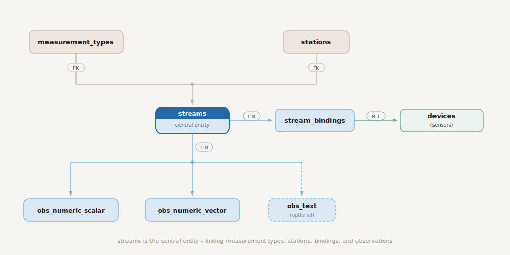

# Numairsia — Authoritative Schema

Last update: March 2026

**Governing principle:**
> A stream is the stable logical time series. A device is the movable and replaceable hardware. Bindings connect them over time.

---

## 1. Technology Stack

| Layer | Choice | Purpose |
| --- | --- | --- |
| Operational database | TimescaleDB on PostgreSQL | Authoritative operational store for metadata and observations |
| Archive format | Apache Parquet on Ceph S3 | Research-facing archive and portable secondary recovery source |
| Archive query engine | DuckDB | Zero-server ad-hoc archive queries |
| Distributed archive queries | Trino / StarRocks / Spark | Larger shared archive workloads |
| Primary write path | Python ingestion process via psycopg | Standard PostgreSQL write path |
| Metadata administration | Governance CLI (Python) | Controlled creation of streams, bindings, and reference data |
| Primary backup / restore | pgBackRest + WAL archiving | Operational disaster recovery and point-in-time recovery |
| Logical export / convenience backup | pg_dump | Schema export, logical migration, and small-table convenience backup |
| Archive export | pg_parquet + pg_incremental + pg_cron | Daily export from PostgreSQL to Parquet on S3 |

Design summary

- PostgreSQL / TimescaleDB is the source of truth.
- Parquet on S3 is a derived archive for researchers and a secondary recovery path.
- Corrections overwrite rows in PostgreSQL with standard SQL `UPDATE` or `INSERT ... ON CONFLICT DO UPDATE`.
- Full operational recovery should prefer pgBackRest. Parquet-based reload remains available when partial rebuild, portability, or archive-only recovery is needed.

---

## 2. Timestamp Convention and UTC Rule

All temporal columns use `timestamptz` and are stored in UTC.

UTC-only rule

- ingestion process runs with `TZ=UTC`
- governance CLI runs with `TZ=UTC`
- PostgreSQL sessions use `SET TIME ZONE 'UTC'`
- DuckDB sessions use `SET TimeZone = 'UTC'` before timestamp comparisons
- other analytical engines must use equivalent UTC session settings

This avoids ambiguous wall-clock handling and keeps database queries, archive partitioning, and restore behavior consistent.

---

## 3. Logical Model



The schema has two layers:

1. **Metadata tables**: small relational reference data
2. **Observation tables**: high-volume hypertables holding one row per logical observation

A logical observation is identified by the natural key:

```text
(stream_id, observed_at)
```

There are no history tables in the operational design. A correction overwrites the current row.

Three timestamps have distinct meanings:

- `observed_at`: when the measurement occurred in the real world
- `ingested_at`: when the logical observation row first entered PostgreSQL
- `updated_at`: when that row was last materially changed

---

## 4. Core Tables

### 4.1 `measurement_types`

```sql
CREATE TABLE measurement_types (
    measurement_type_id  uuid PRIMARY KEY,
    code                 text NOT NULL UNIQUE,
    name                 text,
    value_kind           text NOT NULL CHECK (value_kind IN ('numeric_scalar', 'numeric_vector', 'text')),
    dimension_count      int  NOT NULL CHECK (dimension_count >= 1),
    dimensions           jsonb,
    properties           jsonb,

    CHECK (value_kind = 'numeric_vector' OR dimension_count = 1),
    CHECK (dimensions IS NULL OR jsonb_array_length(dimensions) = dimension_count)
);
```

**Rules:**

- scalar kinds (`numeric_scalar`, `text`) must have `dimension_count = 1`
- `dimensions` may be `NULL` during setup, but vector observations must not be ingested until it is populated
- changing semantics requires a new `measurement_type` row, not in-place mutation

---

### 4.2 `stations`

```sql
CREATE TABLE stations (
    station_id    uuid PRIMARY KEY,
    station_code  text,
    name          text,
    description   text,
    installed_at  timestamptz,
    retired_at    timestamptz,
    properties    jsonb,

    CHECK (retired_at IS NULL OR installed_at IS NULL OR retired_at >= installed_at)
);
```

---

### 4.3 `devices`

```sql
CREATE TABLE devices (
    device_id        uuid PRIMARY KEY,
    manufacturer     text,
    model            text,
    serial_number    text,
    manufactured_at  timestamptz,
    retired_at       timestamptz,
    properties       jsonb,

    CHECK (retired_at IS NULL OR manufactured_at IS NULL OR retired_at >= manufactured_at)
);
```

---

### 4.4 `streams`

```sql
CREATE TABLE streams (
    stream_id            uuid PRIMARY KEY,
    station_id           uuid NOT NULL REFERENCES stations (station_id),
    measurement_type_id  uuid NOT NULL REFERENCES measurement_types (measurement_type_id),
    stream_code          text NOT NULL,
    name                 text,
    created_at           timestamptz,
    retired_at           timestamptz,
    properties           jsonb,

    UNIQUE (station_id, stream_code),
    CHECK (retired_at IS NULL OR created_at IS NULL OR retired_at >= created_at)
);
```

**Rules:**

- `station_id` and `measurement_type_id` are immutable after creation
- if either changes materially, retire the stream and create a new one

---

### 4.5 `stream_bindings`

```sql
CREATE EXTENSION IF NOT EXISTS btree_gist;

CREATE TABLE stream_bindings (
    stream_binding_id   uuid PRIMARY KEY,
    stream_id           uuid NOT NULL REFERENCES streams (stream_id),
    device_id           uuid NOT NULL REFERENCES devices (device_id),
    device_output       text,
    valid_from          timestamptz NOT NULL,
    valid_to            timestamptz,
    replacement_reason  text,
    properties          jsonb,

    CHECK (valid_to IS NULL OR valid_to > valid_from),
    CONSTRAINT stream_bindings_no_overlap
        EXCLUDE USING gist (
            stream_id WITH =,
            tstzrange(valid_from, COALESCE(valid_to, 'infinity'::timestamptz), '[)') WITH &&
        )
);
```

**Rules:**

- for a given `stream_id`, bindings must not overlap (enforced by exclusion constraint)
- the active binding at time `T` is: `valid_from <= T AND (valid_to IS NULL OR valid_to > T)`
- the governance CLI should still pre-validate bindings for operator-friendly error messages

---

### 4.6 `ingest_batches`

Committed batch lineage table. Observation rows point here, not to `ingest_attempts`.

```sql
CREATE TABLE ingest_batches (
    ingest_batch_id    uuid PRIMARY KEY,
    started_at         timestamptz NOT NULL,
    committed_at       timestamptz NOT NULL,
    source_description text,
    scalar_row_count   bigint NOT NULL DEFAULT 0 CHECK (scalar_row_count >= 0),
    vector_row_count   bigint NOT NULL DEFAULT 0 CHECK (vector_row_count >= 0),
    text_row_count     bigint NOT NULL DEFAULT 0 CHECK (text_row_count >= 0),
    dropped_row_count  bigint NOT NULL DEFAULT 0 CHECK (dropped_row_count >= 0),
    properties         jsonb
);
```

**Rules:**

- `ingest_batches` contains successfully committed batches only
- if the batch transaction rolls back, no `ingest_batches` row is committed
- every stored observation row must reference a committed batch

---

### 4.7 `ingest_attempts`

Operational tracking table for every ingestion run attempt.

```sql
CREATE TABLE ingest_attempts (
    ingest_attempt_id   uuid PRIMARY KEY,
    ingest_batch_id     uuid UNIQUE REFERENCES ingest_batches (ingest_batch_id),
    source_description  text,
    started_at          timestamptz NOT NULL DEFAULT clock_timestamp(),
    finished_at         timestamptz,
    status              text NOT NULL CHECK (status IN ('running', 'completed', 'failed')),
    error_message       text,
    properties          jsonb
);
```

**Rules:**

- one row per ingestion attempt
- `status = 'running'` while work is in progress
- `status = 'completed'` is set within the batch transaction and becomes visible only when that transaction commits
- `status = 'failed'` for an attempt that ends without a committed batch
- `ingest_batch_id` is set within the batch transaction alongside the status change; it remains `NULL` from the perspective of other sessions until the transaction commits

---

### 4.8 `obs_numeric_scalar`

```sql
CREATE TABLE obs_numeric_scalar (
    stream_id           uuid              NOT NULL REFERENCES streams (stream_id),
    observed_at         timestamptz       NOT NULL,
    value               double precision  NOT NULL,
    quality_code        text,
    source_system       text,
    ingress_record_id   text,
    ingest_batch_id     uuid              NOT NULL REFERENCES ingest_batches (ingest_batch_id),
    ingested_at         timestamptz       NOT NULL DEFAULT clock_timestamp(),
    updated_at          timestamptz       NOT NULL DEFAULT clock_timestamp(),
    correction_event_id uuid,

    PRIMARY KEY (stream_id, observed_at),
    CHECK (ingress_record_id IS NULL OR source_system IS NOT NULL)
);

SELECT create_hypertable(
    'obs_numeric_scalar',
    'observed_at',
    chunk_time_interval => INTERVAL '1 day'
);
```

```sql
CREATE UNIQUE INDEX obs_numeric_scalar_dedup_idx
    ON obs_numeric_scalar (source_system, ingress_record_id, observed_at)
    WHERE source_system IS NOT NULL AND ingress_record_id IS NOT NULL;

CREATE INDEX obs_numeric_scalar_updated_at_brin
    ON obs_numeric_scalar USING brin (updated_at);

CREATE INDEX obs_numeric_scalar_ingest_batch_idx
    ON obs_numeric_scalar (ingest_batch_id);
```

---

### 4.9 `obs_numeric_vector` (optional)

```sql
CREATE TABLE obs_numeric_vector (
    stream_id           uuid                NOT NULL REFERENCES streams (stream_id),
    observed_at         timestamptz         NOT NULL,
    values              double precision[]  NOT NULL,
    quality_code        text,
    source_system       text,
    ingress_record_id   text,
    ingest_batch_id     uuid                NOT NULL REFERENCES ingest_batches (ingest_batch_id),
    ingested_at         timestamptz         NOT NULL DEFAULT clock_timestamp(),
    updated_at          timestamptz         NOT NULL DEFAULT clock_timestamp(),
    correction_event_id uuid,

    PRIMARY KEY (stream_id, observed_at),
    CHECK (ingress_record_id IS NULL OR source_system IS NOT NULL)
);

SELECT create_hypertable(
    'obs_numeric_vector',
    'observed_at',
    chunk_time_interval => INTERVAL '1 day'
);
```

```sql
CREATE UNIQUE INDEX obs_numeric_vector_dedup_idx
    ON obs_numeric_vector (source_system, ingress_record_id, observed_at)
    WHERE source_system IS NOT NULL AND ingress_record_id IS NOT NULL;

CREATE INDEX obs_numeric_vector_updated_at_brin
    ON obs_numeric_vector USING brin (updated_at);

CREATE INDEX obs_numeric_vector_ingest_batch_idx
    ON obs_numeric_vector (ingest_batch_id);
```

**Rules:**

- `cardinality(values)` must equal the stream measurement type's `dimension_count`
- vector observations must not be accepted until `measurement_types.dimensions` is populated

---

### 4.10 `obs_text` (optional)

```sql
CREATE TABLE obs_text (
    stream_id           uuid         NOT NULL REFERENCES streams (stream_id),
    observed_at         timestamptz  NOT NULL,
    value               text         NOT NULL,
    quality_code        text,
    source_system       text,
    ingress_record_id   text,
    ingest_batch_id     uuid         NOT NULL REFERENCES ingest_batches (ingest_batch_id),
    ingested_at         timestamptz  NOT NULL DEFAULT clock_timestamp(),
    updated_at          timestamptz  NOT NULL DEFAULT clock_timestamp(),
    correction_event_id uuid,

    PRIMARY KEY (stream_id, observed_at),
    CHECK (ingress_record_id IS NULL OR source_system IS NOT NULL)
);

SELECT create_hypertable(
    'obs_text',
    'observed_at',
    chunk_time_interval => INTERVAL '1 day'
);
```

```sql
CREATE UNIQUE INDEX obs_text_dedup_idx
    ON obs_text (source_system, ingress_record_id, observed_at)
    WHERE source_system IS NOT NULL AND ingress_record_id IS NOT NULL;

CREATE INDEX obs_text_updated_at_brin
    ON obs_text USING brin (updated_at);

CREATE INDEX obs_text_ingest_batch_idx
    ON obs_text (ingest_batch_id);
```

---

### 4.11 `correction_events` (optional)

```sql
CREATE TABLE correction_events (
    correction_event_id  uuid PRIMARY KEY,
    created_at           timestamptz NOT NULL DEFAULT clock_timestamp(),
    created_by           text,
    reason               text,
    method               text,
    reference            text,
    properties           jsonb
);
```

Add foreign keys after deployment:

```sql
ALTER TABLE obs_numeric_scalar
    ADD CONSTRAINT obs_numeric_scalar_correction_event_fk
    FOREIGN KEY (correction_event_id) REFERENCES correction_events (correction_event_id);

ALTER TABLE obs_numeric_vector
    ADD CONSTRAINT obs_numeric_vector_correction_event_fk
    FOREIGN KEY (correction_event_id) REFERENCES correction_events (correction_event_id);

ALTER TABLE obs_text
    ADD CONSTRAINT obs_text_correction_event_fk
    FOREIGN KEY (correction_event_id) REFERENCES correction_events (correction_event_id);
```

---

### 4.12 `updated_at` trigger

```sql
CREATE OR REPLACE FUNCTION trg_set_updated_at()
RETURNS trigger LANGUAGE plpgsql AS $$
BEGIN
    NEW.updated_at := clock_timestamp();
    RETURN NEW;
END;
$$;

CREATE TRIGGER set_updated_at_scalar
    BEFORE UPDATE ON obs_numeric_scalar
    FOR EACH ROW
    EXECUTE FUNCTION trg_set_updated_at();

-- Repeat on optional tables when deployed:
-- CREATE TRIGGER set_updated_at_vector
--     BEFORE UPDATE ON obs_numeric_vector
--     FOR EACH ROW
--     EXECUTE FUNCTION trg_set_updated_at();
--
-- CREATE TRIGGER set_updated_at_text
--     BEFORE UPDATE ON obs_text
--     FOR EACH ROW
--     EXECUTE FUNCTION trg_set_updated_at();
```

---

## 5. Observation Lifecycle

### 5.1 Logical identity

The logical observation identity is `(stream_id, observed_at)`.

`ingress_record_id` is **not** the logical observation identity. It is the stable identifier of the upstream input element at the granularity of one ingested observation row.

Examples

- valid: `msg-123#temperature`
- valid: `file-a.csv:row42:humidity`
- unsafe: `msg-123` if one message expands into multiple stored observations

The "unsafe" case is operationally important: if a single upstream message produces two observations that share the same `observed_at` (e.g. temperature and humidity sampled at the same instant), using the bare message ID as `ingress_record_id` for both will cause the partial unique index on `(source_system, ingress_record_id, observed_at)` to reject the second insert. The qualifier (e.g. `#temperature`, `#humidity`) is what makes each `ingress_record_id` unique at the granularity of one stored observation.

---

### 5.2 Replay and correction semantics

Replay handling uses two mechanisms:

1. **Primary-key idempotency** on `(stream_id, observed_at)`
2. **Upstream identity uniqueness** via `(source_system, ingress_record_id, observed_at)` when those fields are present

Rows without `ingress_record_id` still get same-row idempotency through the primary key and upsert logic. What they lose is upstream-identity-based anomaly detection.

---

### 5.3 Ingestion upsert pattern

```sql
INSERT INTO obs_numeric_scalar (
    stream_id,
    observed_at,
    value,
    quality_code,
    source_system,
    ingress_record_id,
    ingest_batch_id,
    correction_event_id
)
VALUES ($1, $2, $3, $4, $5, $6, $7, $8)
ON CONFLICT (stream_id, observed_at) DO UPDATE SET
    value               = EXCLUDED.value,
    quality_code        = EXCLUDED.quality_code,
    source_system       = EXCLUDED.source_system,
    ingress_record_id   = EXCLUDED.ingress_record_id,
    ingest_batch_id     = EXCLUDED.ingest_batch_id,
    correction_event_id = EXCLUDED.correction_event_id
WHERE (obs_numeric_scalar.value, obs_numeric_scalar.quality_code)
      IS DISTINCT FROM (EXCLUDED.value, EXCLUDED.quality_code);
```

Semantics

- exact replay: same key, same value, same quality -> no update
- correction: same key, different value and/or quality -> update occurs
- metadata-only differences do **not** trigger an update
- when an update does occur, the incoming lineage fields (`source_system`, `ingress_record_id`, `ingest_batch_id`, `correction_event_id`) replace the stored values for the current row image

Important consequence

- `ingested_at` records first successful insert time
- `ingest_batch_id` identifies the most recent committed ingestion batch that wrote the current row image
- earlier batch membership is not retained in-row because the operational model keeps no history table

---

### 5.4 `ingested_at` and `updated_at`

`ingested_at` means **first successful insertion time** of the logical observation row.
It does not change on later corrections.

`updated_at` means **last material modification time** of the row.
It changes on correction updates and stays unchanged for replay no-ops.

---

### 5.5 Late observations

Late observations are accepted without a fixed time limit. They are written to the chunk determined by `observed_at`, not by arrival time.

---

### 5.6 Corrections

Corrections overwrite the current row. There is no in-database version chain in the operational design.

If governed correction campaigns become important, deploy `correction_events` and populate `correction_event_id` on the affected rows.

---

## 6. Ingestion Workflow

### 6.1 Write sequence

1. Insert an `ingest_attempts` row with `status = 'running'`
2. Open the main PostgreSQL transaction
3. Insert `ingest_batches`
4. Insert / upsert validated observation rows referencing `ingest_batch_id`
5. Update `ingest_batches` with row counts and `committed_at`
6. Update the matching `ingest_attempts` row to `status = 'completed'`, set `finished_at`, and attach `ingest_batch_id`
7. Commit the main transaction
8. If the main transaction fails, roll it back and update `ingest_attempts` to `status = 'failed'` in a separate transaction

Operational note

 If the process crashes after creating the attempt row but before marking it failed, a stale `running` attempt can remain and must be handled by monitoring / operational cleanup

---

### 6.2 Validation performed by the ingestion process

The ingestion process must:

- confirm `stream_id` exists
- resolve the target observation table from the stream's `measurement_type.value_kind`
- confirm a binding exists for the stream at `observed_at` (warn or reject if no active binding covers the observation timestamp)
- reject NaN, `+Infinity`, and `-Infinity`
- require `source_system` whenever `ingress_record_id` is present
- reject vector rows whose cardinality does not match `measurement_type.dimension_count`
- reject vector rows if `measurement_types.dimensions` is still `NULL`

---

### 6.3 Crash and concurrency behavior

- failed main transactions leave no partial observation rows and no committed `ingest_batches` row
- stale `running` attempts after a process crash must be surfaced by monitoring and marked failed operationally
- concurrent writers are tolerated by PostgreSQL row-level locking and the uniqueness rules, but single-writer operation remains operationally simpler

---

## 7. TimescaleDB Configuration

### 7.1 Chunk interval

Use a 1-day chunk interval on all observation hypertables.

---

### 7.2 Compression

```sql
ALTER TABLE obs_numeric_scalar SET (
    timescaledb.compress,
    timescaledb.compress_segmentby = 'stream_id',
    timescaledb.compress_orderby = 'observed_at ASC'
);

SELECT add_compression_policy('obs_numeric_scalar', INTERVAL '10 days');
```

Apply the same pattern to optional observation tables when deployed.

Operational rule

- archive export is delayed by 7 days
- compression begins at 10 days
- this leaves a small buffer so exports normally read uncompressed recent data

---

## 8. Null / NaN / Infinity Policy

- NaN, `+Infinity`, and `-Infinity` are rejected by ingestion
- invalid numeric readings are dropped, not stored as stand-in values
- dropped counts are recorded in `ingest_batches`
- `quality_code` is for valid readings with quality concerns, not for non-finite placeholders

---

## 9. Schema Evolution and `properties` Governance

### 9.1 Schema evolution

Schema evolution follows standard PostgreSQL DDL.

Rules

- add columns with `ALTER TABLE ... ADD COLUMN`
- rename columns only for wording clarity, not semantic change
- never reuse a dropped column name with a new meaning
- use safe type promotions only
- change measurement semantics by creating a new `measurement_type`
- change stream identity by retiring the stream and creating a new one

Archive note

- after a column is added or removed, Parquet files in the archive will have heterogeneous schemas
- DuckDB requires `union_by_name = true` to unify columns by name and fill missing columns with NULL
- Spark, Polars, and Trino handle heterogeneous schemas through their own catalog or read options

---

### 9.2 `properties` governance

`properties jsonb` is for operator-managed metadata that is not used in query predicates, joins, or analytical rules.

Any field needed in filtering, joins, or business logic must be promoted to an explicit column.

---

## 10. Export Pipeline and Archive Layout

### 10.1 Observation export

Export daily Parquet snapshots from PostgreSQL to S3 using `SELECT *`. All observation table columns are included. No columns are excluded.

Future columns added via schema evolution are automatically picked up by the export without modifying the export function.

`updated_at` is included to preserve recovery fidelity if observation data is later restored from Parquet.

---

### 10.2 Metadata export

Export these tables to `archive/metadata/`:

- `measurement_types`
- `stations`
- `devices`
- `streams`
- `stream_bindings`
- `ingest_batches`
- `correction_events` when deployed

`ingest_attempts` is operational and should not be exported to the researcher-facing archive.

---

### 10.3 S3 layout

```text
s3://numairsia/
├── archive/
│   ├── obs_numeric_scalar/year=YYYY/month=MM/day=DD/data.parquet
│   ├── obs_numeric_vector/year=YYYY/month=MM/day=DD/data.parquet
│   ├── obs_text/year=YYYY/month=MM/day=DD/data.parquet
│   └── metadata/
│       ├── measurement_types.parquet
│       ├── stations.parquet
│       ├── devices.parquet
│       ├── streams.parquet
│       ├── stream_bindings.parquet
│       ├── ingest_batches.parquet
│       └── correction_events.parquet
└── curated/
```

Hive-style partitioning (`key=value` directories) enables DuckDB, Spark, and Polars to auto-prune files based on `WHERE` predicates on partition keys with no manual glob construction.

---

### 10.4 DuckDB archive query rule

Use `union_by_name = true` when reading multiple Parquet files after schema evolution.

Example:

```sql
SELECT observed_at, value
FROM read_parquet(
    's3://numairsia/archive/obs_numeric_scalar/*/*/*/data.parquet',
    hive_partitioning = true,
    union_by_name = true
)
WHERE year = 2025 AND month = 1
  AND stream_id = '<uuid>'
ORDER BY observed_at;
```

DuckDB auto-detects the `year=.../month=.../day=...` directory structure and prunes files that do not match the `WHERE` predicates on partition keys. Partition columns are auto-detected as `BIGINT`, so use integer literals (e.g. `month = 1`, not `month = '01'`).

---

### 10.5 Observation export implementation

PostgreSQL's `COPY TO` requires a string literal for the destination path. Since pg_incremental passes `$1` and `$2` as timestamptz parameters, a PL/pgSQL wrapper function with `EXECUTE format(...)` is needed to construct the dynamic path.

```sql
CREATE EXTENSION pg_incremental CASCADE;  -- pulls in pg_cron

CREATE OR REPLACE FUNCTION export_obs_numeric_scalar(start_time timestamptz, end_time timestamptz)
RETURNS void LANGUAGE plpgsql AS $function$
BEGIN
    EXECUTE format(
        $$COPY (
            SELECT *
            FROM obs_numeric_scalar
            WHERE observed_at >= %L AND observed_at < %L
            ORDER BY stream_id, observed_at
        )
        TO %L
        WITH (format 'parquet', compression 'zstd')$$,
        start_time, end_time,
        format('s3://numairsia/archive/obs_numeric_scalar/year=%s/month=%s/day=%s/data.parquet',
               to_char(start_time::date, 'YYYY'),
               to_char(start_time::date, 'MM'),
               to_char(start_time::date, 'DD'))
    );
END;
$function$;

SELECT incremental.create_time_interval_pipeline(
    'daily-obs-scalar-export',
    time_interval := '1 day',
    batched       := false,
    start_time    := '2025-01-01',
    min_delay     := '7 days',
    command       := 'SELECT export_obs_numeric_scalar($1, $2)'
);
```

**Why `SELECT *`:** no observation table columns are excluded from the archive. Using `SELECT *` ensures that columns added via schema evolution are automatically included in future exports without modifying the function.

**Why `ORDER BY stream_id, observed_at`:** produces well-ordered row groups so analytical engines can skip irrelevant data using min/max statistics.

Apply the same wrapper-function pattern to `obs_numeric_vector` and `obs_text` when deployed.

---

### 10.6 Metadata and audit table export

Small tables are exported as full overwrites via pg_cron:

```sql
-- Scheduled via pg_cron (e.g. daily at 01:00 UTC)

COPY (SELECT * FROM measurement_types) TO 's3://numairsia/archive/metadata/measurement_types.parquet' WITH (format 'parquet', compression 'zstd');
COPY (SELECT * FROM stations)           TO 's3://numairsia/archive/metadata/stations.parquet'           WITH (format 'parquet', compression 'zstd');
COPY (SELECT * FROM devices)            TO 's3://numairsia/archive/metadata/devices.parquet'            WITH (format 'parquet', compression 'zstd');
COPY (SELECT * FROM streams)            TO 's3://numairsia/archive/metadata/streams.parquet'            WITH (format 'parquet', compression 'zstd');
COPY (SELECT * FROM stream_bindings)    TO 's3://numairsia/archive/metadata/stream_bindings.parquet'    WITH (format 'parquet', compression 'zstd');
COPY (SELECT * FROM ingest_batches)     TO 's3://numairsia/archive/metadata/ingest_batches.parquet'     WITH (format 'parquet', compression 'zstd');

-- Add when correction_events is deployed:
-- COPY (SELECT * FROM correction_events) TO 's3://numairsia/archive/metadata/correction_events.parquet' WITH (format 'parquet', compression 'zstd');
```

---

### 10.7 Manual re-export after corrections

If a correction is made to data that has already been exported, re-export the affected day by calling the export function directly:

```sql
SELECT export_obs_numeric_scalar(
    '2025-03-01 00:00:00+00'::timestamptz,
    '2025-03-02 00:00:00+00'::timestamptz
);
```

If post-export corrections become frequent, an automated re-export job can be added using pg_cron and the `updated_at` BRIN index to scan for affected days.

---

## 11. Backup and Disaster Recovery

### 11.1 Primary operational backup / restore

Use **pgBackRest with WAL archiving** as the primary operational backup and restore mechanism.

This is the preferred path when:

- the full PostgreSQL / TimescaleDB cluster must be restored
- point-in-time recovery is required
- Parquet-based rebuild is unavailable, incomplete, or simply not desired

---

### 11.2 Logical export backup

`pg_dump` remains useful for:

- schema export
- logical migration
- convenience backup of small metadata tables

It is not the primary operational recovery mechanism for the time-series store.

---

### 11.3 Secondary recovery from Parquet

Parquet remains a valid secondary recovery path for observation data.

Use it when:

- rebuilding only the observation layer
- restoring to a new environment from archive data
- recovering after loss of the operational database when the archive is still available

---

### 11.4 Restore procedure for Parquet-based recovery

**Step 1: Stop ingestion and export jobs.**

**Step 2: Restore schema and metadata.** Use `pg_dump` / `pg_restore` for the database schema, then restore metadata tables: `measurement_types`, `stations`, `devices`, `streams`, `stream_bindings`. Restore audit parents: `ingest_batches`, then `correction_events` if deployed.

**Step 3: Import observation data from Parquet.** Use pg_incremental's file list pipeline to import files one at a time with automatic progress tracking:

```sql
CREATE OR REPLACE FUNCTION import_obs_numeric_scalar(path text)
RETURNS void LANGUAGE plpgsql AS $fn$
BEGIN
    EXECUTE format(
        $$COPY obs_numeric_scalar FROM %L WITH (format 'parquet', match_by 'name')$$,
        path
    );
END;
$fn$;

SELECT incremental.create_file_list_pipeline(
    'obs-scalar-import',
    file_pattern := 's3://numairsia/archive/obs_numeric_scalar/**/*.parquet',
    list_function := 'parquet.list',
    command       := 'SELECT import_obs_numeric_scalar($1)'
);
```

> **Note:** pg_incremental's file list pipelines are marked as preview. Validate the `parquet.list` / `list_function` integration during OQ-2 testing before relying on it for disaster recovery.

**Fallback procedure** if the file list pipeline integration is not available:

```sql
CREATE TABLE IF NOT EXISTS import_progress (
    uri text PRIMARY KEY,
    imported_at timestamptz NOT NULL DEFAULT clock_timestamp()
);

CREATE OR REPLACE PROCEDURE restore_obs_numeric_scalar()
LANGUAGE plpgsql AS $$
DECLARE
    file record;
    imported_count int := 0;
BEGIN
    FOR file IN
        SELECT uri FROM parquet.list('s3://numairsia/archive/obs_numeric_scalar/**/*.parquet')
        WHERE uri NOT IN (SELECT uri FROM import_progress)
        ORDER BY uri
    LOOP
        EXECUTE format(
            $$COPY obs_numeric_scalar FROM %L WITH (format 'parquet', match_by 'name')$$,
            file.uri
        );
        INSERT INTO import_progress (uri) VALUES (file.uri);
        COMMIT;

        imported_count := imported_count + 1;
        RAISE NOTICE 'Imported file %: %', imported_count, file.uri;
    END LOOP;

    RAISE NOTICE 'Restore complete. % files imported.', imported_count;
END;
$$;

CALL restore_obs_numeric_scalar();
```

**`match_by 'name'`:** matches Parquet columns to PostgreSQL columns by name rather than position. Table columns not present in the Parquet file receive their default value or NULL. This is relevant after schema evolution adds new columns to the table that older Parquet files do not contain. Validate this behavior during OQ-2 testing.

**Step 4: Re-enable compression policies.** TimescaleDB compression will automatically compress chunks older than 10 days.

**Step 5: Re-enable export jobs.** Reset or recreate the export pipeline with a `start_time` after the last successfully exported day.

**Step 6: Validate.** Compare row counts per day in TimescaleDB against Parquet file row counts. Run sample queries to verify data integrity.

---

### 11.5 Data loss window

The Parquet archive lags by 7 days. In a disaster recovery scenario, up to 7 days of recent data may not be in the archive. This window is covered by pgBackRest. The recovery strategy is: restore from pgBackRest for the full cluster, or restore from Parquet for the observation layer when pgBackRest is not available.

---

### 11.6 Recovery policy

- default operational DR path: pgBackRest restore
- secondary / portable recovery path: Parquet import
- both paths should be tested regularly

---

## 12. Enforcement Model

### Database-enforced

- observation uniqueness by `(stream_id, observed_at)`
- `measurement_types.code` uniqueness
- `streams (station_id, stream_code)` uniqueness
- stream / measurement / device / batch referential integrity
- stream-binding non-overlap for the same `stream_id`
- `source_system` required when `ingress_record_id` is present
- scalar kinds imply `dimension_count = 1`
- `dimensions` array length equals `dimension_count` when populated
- sanity checks on lifecycle timestamps

### Application-enforced

- stream immutability after creation
- routing to the correct observation table by `value_kind`
- vector cardinality match against `measurement_type.dimension_count`
- rejection of NaN and infinities
- operator workflow around device replacement and binding creation

---

## 13. Operational Monitoring

At minimum, monitor:

- stale `running` rows in `ingest_attempts`
- failed ingestion attempts
- rows ingested per committed batch
- dropped-row counts
- abnormal reject rates
- export lag (compare `last_processed_time` in `incremental.time_interval_pipelines` against expected date)
- pgBackRest backup success
- WAL archiving health
- restore test success

---

## 14. Open Questions Before Production

1. finalize controlled vocabulary for `quality_code`
2. validate exact `pg_parquet` + `pg_incremental` compatibility on the target PostgreSQL / TimescaleDB build, including `match_by 'name'` behavior with missing columns and `parquet.list` / `list_function` integration
3. document network failure buffering and backlog limits on the ingestion host
4. decide whether single-writer operation is enforced operationally or merely tolerated
5. define the operational procedure for cleaning up stale `running` attempts after crashes
6. decide whether to add explicit geographic location columns (latitude, longitude, elevation) to the `stations` table, or whether `properties jsonb` is sufficient for location metadata

---

## 15. Common Query Patterns

Each pattern is shown twice: first against TimescaleDB, then against the Parquet archive in DuckDB.

**DuckDB session setup.** Before running archive queries, create convenience views so that each query reads naturally:

```sql
-- Run once per DuckDB session

CREATE OR REPLACE VIEW obs AS
SELECT * FROM read_parquet(
    's3://numairsia/archive/obs_numeric_scalar/*/*/*/data.parquet',
    hive_partitioning = true,
    union_by_name = true
);

CREATE OR REPLACE VIEW obs_vec AS
SELECT * FROM read_parquet(
    's3://numairsia/archive/obs_numeric_vector/*/*/*/data.parquet',
    hive_partitioning = true,
    union_by_name = true
);

CREATE OR REPLACE VIEW streams AS
SELECT * FROM 's3://numairsia/archive/metadata/streams.parquet';

CREATE OR REPLACE VIEW stations AS
SELECT * FROM 's3://numairsia/archive/metadata/stations.parquet';

CREATE OR REPLACE VIEW devices AS
SELECT * FROM 's3://numairsia/archive/metadata/devices.parquet';

CREATE OR REPLACE VIEW stream_bindings AS
SELECT * FROM 's3://numairsia/archive/metadata/stream_bindings.parquet';

CREATE OR REPLACE VIEW measurement_types AS
SELECT * FROM 's3://numairsia/archive/metadata/measurement_types.parquet';

CREATE OR REPLACE VIEW ingest_batches AS
SELECT * FROM 's3://numairsia/archive/metadata/ingest_batches.parquet';
```

Hive partition columns (`year`, `month`, `day`) are auto-detected as `BIGINT` in observation views. Use integer literals in `WHERE` clauses (e.g. `month = 1`, not `month = '01'`).

---

### 15.1 One stream over a time range

TimescaleDB

```sql
SELECT observed_at, value
FROM obs_numeric_scalar
WHERE stream_id = '<uuid>'
  AND observed_at >= '2025-01-01 00:00:00+00'
  AND observed_at <  '2025-02-01 00:00:00+00'
ORDER BY observed_at;
```

DuckDB (archive)

```sql
SELECT observed_at, value
FROM obs
WHERE year = 2025 AND month = 1
  AND stream_id = '<uuid>'
ORDER BY observed_at;
```

---

### 15.2 All streams at a station for a day

TimescaleDB

```sql
SELECT o.observed_at, s.stream_code, o.value
FROM obs_numeric_scalar o
JOIN streams s ON o.stream_id = s.stream_id
WHERE s.station_id = '<uuid>'
  AND o.observed_at >= '2025-01-01 00:00:00+00'
  AND o.observed_at <  '2025-01-02 00:00:00+00'
ORDER BY o.observed_at, s.stream_code;
```

DuckDB (archive)

```sql
SELECT o.observed_at, s.stream_code, o.value
FROM obs o
JOIN streams s ON o.stream_id = s.stream_id
WHERE s.station_id = '<uuid>'
  AND o.year = 2025 AND o.month = 1 AND o.day = 1
ORDER BY o.observed_at, s.stream_code;
```

---

### 15.3 Hourly aggregates

TimescaleDB

```sql
SELECT stream_id,
       date_trunc('hour', observed_at) AS hour,
       avg(value), min(value), max(value)
FROM obs_numeric_scalar
WHERE observed_at >= '2025-01-01 00:00:00+00'
  AND observed_at <  '2025-01-08 00:00:00+00'
GROUP BY stream_id, date_trunc('hour', observed_at)
ORDER BY stream_id, hour;
```

DuckDB (archive)

```sql
SELECT stream_id,
       date_trunc('hour', observed_at) AS hour,
       avg(value), min(value), max(value)
FROM obs
WHERE year = 2025 AND month = 1 AND day BETWEEN 1 AND 7
GROUP BY stream_id, date_trunc('hour', observed_at)
ORDER BY stream_id, hour;
```

---

### 15.4 Which device produced a stream during a time range

TimescaleDB

```sql
SELECT b.device_id, b.valid_from, b.valid_to,
       d.manufacturer, d.model, d.serial_number
FROM stream_bindings b
JOIN devices d ON b.device_id = d.device_id
WHERE b.stream_id = '<uuid>'
  AND b.valid_from  < '2025-02-01 00:00:00+00'
  AND (b.valid_to IS NULL OR b.valid_to > '2025-01-01 00:00:00+00')
ORDER BY b.valid_from;
```

DuckDB (archive)

```sql
SELECT b.device_id, b.valid_from, b.valid_to,
       d.manufacturer, d.model, d.serial_number
FROM stream_bindings b
JOIN devices d ON b.device_id = d.device_id
WHERE b.stream_id = '<uuid>'
  AND b.valid_from  < TIMESTAMPTZ '2025-02-01 00:00:00+00'
  AND (b.valid_to IS NULL OR b.valid_to > TIMESTAMPTZ '2025-01-01 00:00:00+00')
ORDER BY b.valid_from;
```

---

### 15.5 Quality-filtered query

TimescaleDB

```sql
SELECT observed_at, value
FROM obs_numeric_scalar
WHERE stream_id = '<uuid>'
  AND observed_at >= '2025-01-01 00:00:00+00'
  AND observed_at <  '2025-02-01 00:00:00+00'
  AND (quality_code IS NULL OR quality_code NOT IN ('suspect', 'bad'))
ORDER BY observed_at;
```

DuckDB (archive)

```sql
SELECT observed_at, value
FROM obs
WHERE year = 2025 AND month = 1
  AND stream_id = '<uuid>'
  AND (quality_code IS NULL OR quality_code NOT IN ('suspect', 'bad'))
ORDER BY observed_at;
```

---

### 15.6 Audit: all observations in a specific batch

TimescaleDB

```sql
SELECT stream_id, observed_at, value, quality_code
FROM obs_numeric_scalar
WHERE ingest_batch_id = '<uuid>'
ORDER BY observed_at;
```

DuckDB (archive)

```sql
SELECT stream_id, observed_at, value, quality_code
FROM obs
WHERE ingest_batch_id = '<uuid>'
ORDER BY observed_at;
```

Note: this query cannot use Hive partition pruning because `ingest_batch_id` is not a partition key. For large archives, narrowing the time range with `year`/`month`/`day` predicates significantly improves performance.

---

### 15.7 GPS vector retrieval with dimension names

TimescaleDB

```sql
SELECT o.observed_at, o.values,
       mt.dimensions->0->>'name' AS dim1,
       mt.dimensions->1->>'name' AS dim2,
       mt.dimensions->2->>'name' AS dim3
FROM obs_numeric_vector o
JOIN streams s ON o.stream_id = s.stream_id
JOIN measurement_types mt ON s.measurement_type_id = mt.measurement_type_id
WHERE o.stream_id = '<uuid>'
  AND o.observed_at >= '2025-01-01 00:00:00+00'
  AND o.observed_at <  '2025-01-02 00:00:00+00'
ORDER BY o.observed_at;
```

DuckDB (archive)

```sql
SELECT o.observed_at, o.values,
       mt.dimensions::JSON->0->>'name' AS dim1,
       mt.dimensions::JSON->1->>'name' AS dim2,
       mt.dimensions::JSON->2->>'name' AS dim3
FROM obs_vec o
JOIN streams s ON o.stream_id = s.stream_id
JOIN measurement_types mt ON s.measurement_type_id = mt.measurement_type_id
WHERE o.stream_id = '<uuid>'
  AND o.year = 2025 AND o.month = 1 AND o.day = 1
ORDER BY o.observed_at;
```

`pg_parquet` exports `jsonb` as Parquet STRING. DuckDB requires an explicit `::JSON` cast before using the `->` and `->>` extraction operators.

---

### 15.8 Full device history across moves and replacements

TimescaleDB

```sql
SELECT b.valid_from, b.valid_to, s.stream_code, st.station_code, mt.code AS measurement_code
FROM stream_bindings b
JOIN streams s  ON b.stream_id = s.stream_id
JOIN stations st ON s.station_id = st.station_id
JOIN measurement_types mt ON s.measurement_type_id = mt.measurement_type_id
WHERE b.device_id = '<uuid>'
ORDER BY b.valid_from;
```

DuckDB (archive)

```sql
SELECT b.valid_from, b.valid_to, s.stream_code, st.station_code, mt.code AS measurement_code
FROM stream_bindings b
JOIN streams s  ON b.stream_id = s.stream_id
JOIN stations st ON s.station_id = st.station_id
JOIN measurement_types mt ON s.measurement_type_id = mt.measurement_type_id
WHERE b.device_id = '<uuid>'
ORDER BY b.valid_from;
```

This query uses only metadata tables, so it works identically against the archive views with no partition filtering needed.
